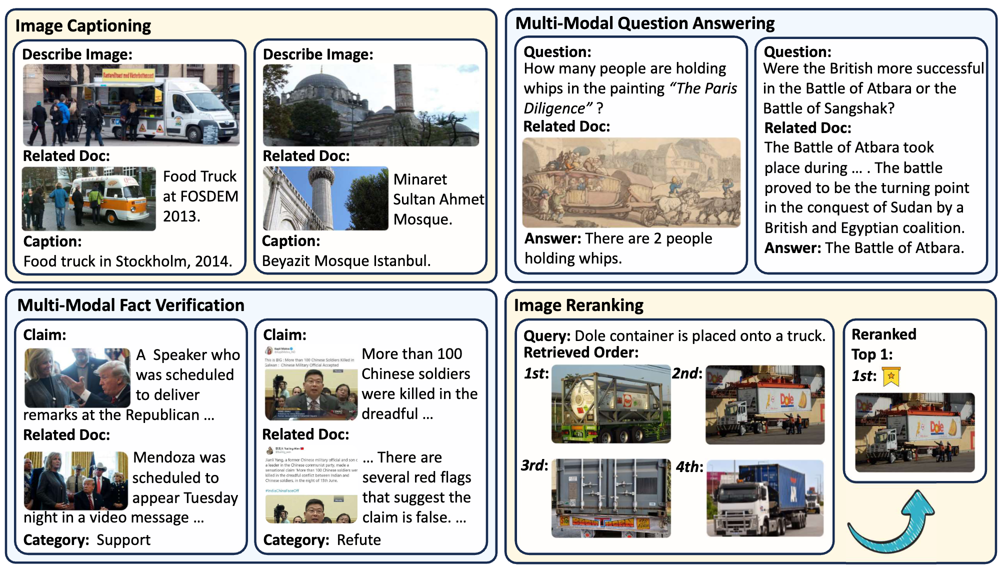

# Benchmarking Retrieval-Augmented Generation in Multi-Modal Contexts
Source code for our paper : [Benchmarking Retrieval-Augmented Generation in Multi-Modal Contexts](https://arxiv.org/abs/2502.17297)

Click the links below to view our paper and datasets.

<a href='https://arxiv.org/abs/2502.17297'></a><a href='https://huggingface.co/datasets/whalezzz/M2RAG'></a>

If you find this work useful, please cite our paper  and give us a shining star 🌟

```
@misc{liu2025benchmarkingretrievalaugmentedgenerationmultimodal,
      title={Benchmarking Retrieval-Augmented Generation in Multi-Modal Contexts}, 
      author={Zhenghao Liu and Xingsheng Zhu and Tianshuo Zhou and Xinyi Zhang and Xiaoyuan Yi and Yukun Yan and Yu Gu and Ge Yu and Maosong Sun},
      year={2025},
      eprint={2502.17297},
      archivePrefix={arXiv},
      primaryClass={cs.AI},
      url={https://arxiv.org/abs/2502.17297}, 
}
```


## 🎃 Overview

The **$M^2RAG$** benchmark evaluates Multi-modal Large Language Models (MLLMs) by using multi-modal retrieved documents to answer questions. It includes four tasks: image captioning, multi-modal QA, fact verification, and image reranking, assessing MLLMs’ ability to leverage knowledge from multi-modal contexts. 

The **Multi-Modal Retrieval Augmented Instruction Tuning (MM-RAIT)** method further adapts MLLMs to multi-modal in-context learning, enhancing their effectiveness in utilizing knowledge from these retrieval documents.


<p align="center">
  
</p>

## 🎃 Requirement
**🌵 1. Install the following packages using Pip or Conda under this environment**

```
Python==3.10
Pytorch
transformers==4.44.2 (4.46.1 for finetune qwen2-vl)
clip
faiss==1.9.0
tqdm
numpy
base64
diffusers
flash-attn
xformers
llamafactory
accelerate
nltk
rouge_score
sklearn
```
We provide the version file `requirements.txt` of all our used packages, if you have any problems configuring the environment, please refer to this document.

**🌵 2. Prepare the pretrained models: MiniCPM-V 2.6, Qwen2-VL, and VISTA**

**MM-RAIT** is built on [MiniCPM-V 2.6](https://huggingface.co/openbmb/MiniCPM-V-2_6) and [Qwen2-VL](https://huggingface.co/Qwen/Qwen2-VL-7B-Instruct) model. [VISTA](https://huggingface.co/BAAI/bge-visualized) is used for retrieval multi-modal documents.

## 🎃 Reproduce MM-RAIT

### 🌵 Download Code & Dataset
* First, use `git clone` to download this project:
```bash
git clone https://github.com/NEUIR/M2RAG
cd M2RAG
```
* Second, you can either directly download and use [M2RAG](https://huggingface.co/datasets/whalezzz/M2RAG), or follow the instructions in 'data/data_preprocess' to build it step by step. Please place the downloaded dataset in the data folder.
(❗️Note: For the ```imgs.tsv```, you need to download the data from [this link](https://drive.google.com/drive/folders/1ApfD-RzvJ79b-sLeBx1OaiPNUYauZdAZ?usp=sharing) and run ```7z x imgs.7z.001```).

```
data/
└──m2rag/
    ├──fact_verify/
    ├──image_cap/
    ├──image_rerank/
    ├──mmqa/
    ├──imgs.lineidx.new
    └──imgs.tsv
    
```
### 🌵 Inference for Zero-Shot setting
Once the dataset and vanilla models are ready, you can follow the instructions below to reproduce our zero-shot results.

* Step 1: Encode the queries from the test set and the multi-modal corpus for each task.
```
cd script
bash get_embed_test.sh
```

* Step 2: Retrieve the topN most relevant multi-modal documents for each query.
```
bash retrieval_test.sh
```
* Step 3: Use the retrieved documents for vanilla RAG inference.
```
bash inference_cpmv.sh or bash inference_qwen.sh
```
For Image Reranking task, please use:
```
bash compute_ppl_minicpmv.sh or bash compute_ppl_qwen2vl.sh
```
### 🌵 Train MM-RAIT using MM-RAIT
**Using the MiniCPM-V 2.6 models as an example, I will show you how to reproduce the results in this paper. The same is true for the Qwen2-VL. Also, we provide fine-tuned checkpoints. You can skip this step and proceed directly to inference.**

* First step: Prepare the training data.
```
bash get_embed_train.sh
bash retrieval_train.sh
cd ../data/
bash finetune/construct_finetune_data.sh
```

* Second step: Fine-tune the MiniCPM-V model using LoRA.
```
cd ../script
bash finetune_cpmv.sh
```

* Final step: Use the fine-tuned model for inference.
```
bash inference_cpmv.sh
```
For Image Reranking task, please use:
```
bash compute_ppl_minicpmv.sh
```
## 🎃 Evaluate Generation Effectiveness
Go to the ``src/evaluation`` folder and evaluate model performance as follow:
* For Image Captioning and Muit-modal QA tasks, please use:
```
python generation.py --reference_file path_to_reference_data --candidate_file path_to_generation_data
```
* For Multi-Modal Factify Verification task, please use:
```
python evaluation/classification.py --true_file path_to_reference_data --pred_file path_to_generation_data
```
* For Image Reranking task, please use:
```
python -m pytorch_fid path/to/reference_images path/to/rerank_images
```

## 🎃 Contact
If you have questions, suggestions, and bug reports, please email:
```bash
zhuxingsheng@stumail.neu.edu.cn     zhoutianshuo@stumail.neu.edu.cn 
```